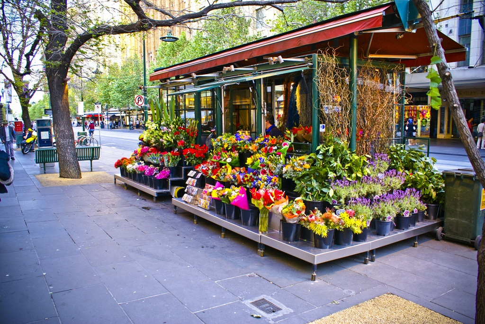
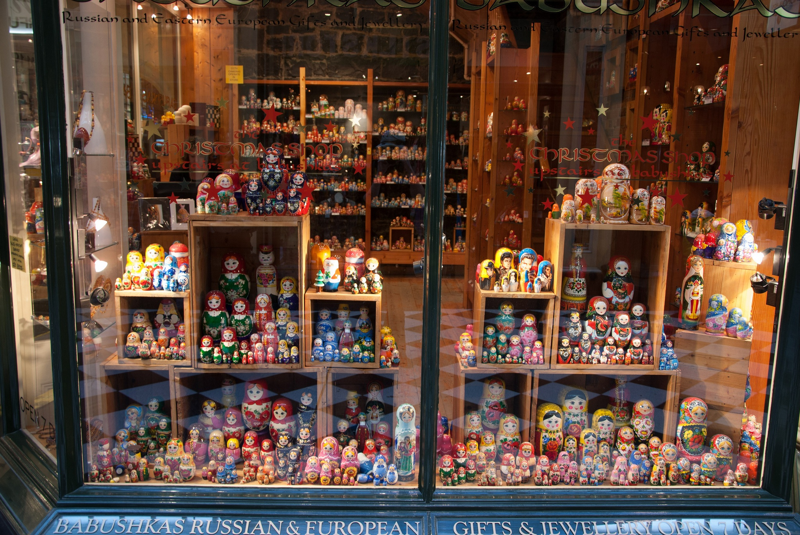

## Shopping in Melbourne

Shopping in Melbourne is a very interesting and exciting activity. Melbourne has long been a major hub for Australian shopping. One of the main places to buy souvenirs is the famous Queen Victoria Market. In this place you can find almost everything, from T-shirts with the symbols of the city to jewelry. For example, products related to the Aboriginal culture will be excellent souvenirs: ritual masks, boomerangs, etc. There are several well-known brands of Australian clothing, they can be purchased in numerous Melbourne boutiques in the city center.

Recently, Melbourne has ceased to live up to its reputation as a city of "low prices", which is why it immediately dropped several positions in the list of cities most convenient for living. The are considered to be Aboriginal markets and communal trade areas, where you have the opportunity to make excellent bargains, significantly reducing the initial cost of the goods.

Collins Street has a reputation for being the most elegant street. Its eastern part is called the "Parisian End", as it houses many boutiques of the most famous brands and first-class jewelry companies. Australia are large department stores. Toorak streets of exclusive shops. Melbourne's specialty is the narrow passages between the central streets. Locals call them "arcades", their width does not exceed 3-4 meters. The streets are filled with cute cafes for all tastes and great shops. The Royal are housed in historic buildings and contain many small specialty shops and boutiques. One of the recently refurbished Hardware Line arcades is very similar to the side streets of Paris, as it houses a number of cozy restaurants and cafes with their tables on the street, right in front of the entrance to the establishment. There you can hear live music, which creates a rather festive atmosphere.

To purchase the brightest and most unique souvenirs, you can go to the ### following shops:

1. Saba is the boutique boutique of famous located throughout Melbourne.

2. Ozmosis - if you want to buy surfing equipment, go here. In addition, here you can find boogie boards and sunglasses, and there are always beach accessories for any "wallet".

3. Original Get your hands on original Australian crafts here. Souvenirs, art objects, traditional bark drawings are combined with interesting and informative presentations.

4. Haigh`s Chocolates is one of the premier sweet spots in you can sample over 50 local chocolates, ranging from plain milk to bitter dark. The local fruit-flavored chocolate is especially famous. Myer is one of Melbourne's oldest department stores and is part of a nationwide department store chain, with a huge selection, homeware, electronics and more.

5. Dinosaur Designs - the designers of this brand are known to many for their jewelry and products made from solid resins, for example, from rubber.

6. David Jones is on Bourke Street, one of Myer's main competitors. It is housed in two huge buildings, inside which are shops with women's and men's clothing, as well as many other shops.

7. Country Road is one of the most popular clothing brands in Australia.

8. Vegan Wares - this store sells leather goods and shoes made of the highest quality leather, however, as the name of the store suggests, animal skins are not used - this is the ethics of this brand.

9. Altman & Cherny is a famous Melbourne opal store, where you should visit at least to see the largest opal in the world, "Olympyc Australis", found in 1956 in South Australia by Coober Peddy.

